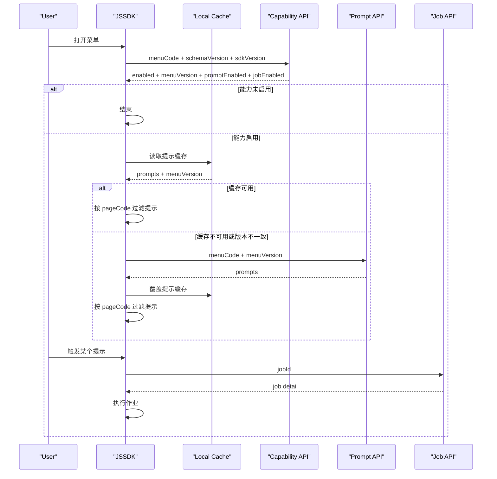

# JSSDK 缓存方案详细设计（能力检查 + 提示缓存 + 作业延迟加载）

> 版本：v2.3  
> 日期：2026-03-21  
> 文档定位：技术经理评审稿 / 研发落地稿  
> 适用范围：开阳系统菜单打开链路中的 JSSDK 页面运行时配置加载

## 1. 文档目标

本文用于明确 JSSDK 的缓存方案主设计，重点回答：

1. 先查能力开关，如何尽早结束无效加载。
2. 启用后，智能提示如何按菜单缓存并按页面过滤。
3. 智能作业如何在提示触发后按 `jobId` 延迟加载。
4. 缓存如何失效、降级和治理。

本次确认后的主方向为：

`能力检查 -> 菜单内智能提示列表缓存 -> 按 pageCode 过滤 -> 智能作业按 jobId 延迟加载 -> 本地缓存复用`

## 2. 背景

当前菜单打开链路可以简化为：

`打开菜单 -> 注入 JSSDK -> iframe 内 JSSDK 初始化 -> 查询能力开关 -> 拉取当前菜单下智能提示 -> 页面过滤 -> 触发后加载智能作业 -> JSSDK ready`

当前问题主要有：

1. 如果所有运行态配置都一次性拉取，首屏会偏重。
2. 如果不做缓存，同一菜单下反复进入不同页面会重复请求。
3. 如果不先判断能力开关，就会做很多无效加载。
4. 如果把智能作业和智能提示绑定成同一加载时机，链路会更长。

## 3. 设计结论

### 3.1 主方案

`V1` 采用以下方案：

1. JSSDK 先请求服务端做能力检查。
2. 若当前菜单未启用智能提示或智能作业，直接结束，不继续加载。
3. 若能力启用，则继续请求“当前菜单下可用的智能提示列表”。
4. 智能提示列表缓存到本地，缓存 key 与 `menuCode` 和版本相关。
5. JSSDK 再按当前页面 `pageCode` 或 `pageResourceId` 过滤出本页可用提示。
6. 智能作业不随菜单提示列表一并加载。
7. 智能作业只在提示触发时按 `jobId` 延迟加载。

### 3.2 当前阶段不采用的方案

`V1` 不作为主实现的方案包括：

1. 一次性拉取菜单下全部提示、作业、接口、规则的整包配置。
2. JSSDK 直接维护完整运行时树并在本地自行装配全部能力。
3. 命中本地缓存后完全不做服务端能力探测。
4. 直接把智能作业和智能提示绑定成同一加载包。

### 3.3 方案定位

该方案本质上是：

`能力短路 + 提示优先缓存 + 作业按需加载`

它优先解决：

1. 无效加载过多的问题。
2. 重复进入同一菜单时的重复请求问题。
3. 智能提示和智能作业加载时机不同的问题。

## 4. 设计原则

1. 稳定性优先：不能因为缓存引入白屏、卡死、长时间无响应。
2. 首屏优先轻量：先判断能力，再加载提示，不预拉作业。
3. 缓存分层清晰：能力检查、提示缓存、作业加载分开处理。
4. 版本模型尽量简单：缓存失效仍以菜单版本为主。
5. 主流程可降级：缓存异常不能阻塞主流程。

## 5. 核心概念

### 5.1 menuVersion

`menuVersion` 是服务端维护的菜单级配置版本号，表示：

1. 某菜单当前生效提示配置集合的逻辑版本。
2. 当菜单下影响智能提示结果的配置发生生效变更时，需要升级。
3. 智能作业本身不跟随提示列表缓存一起下发，因此作业不以提示列表版本作为主加载依据。

### 5.2 能力开关

能力开关用于判断当前菜单是否允许继续加载：

1. 智能提示是否启用。
2. 智能作业是否启用。

能力未启用时，JSSDK 不再继续加载后续配置。

### 5.3 提示缓存

JSSDK 本地缓存保存的是：

1. 当前菜单对应的智能提示列表。
2. 对应的 `menuVersion`。
3. 页面归属字段，例如 `pageCode` 或 `pageResourceId`。
4. 生成时间、过期时间等辅助字段。

### 5.4 作业延迟加载

智能作业不作为菜单缓存的一部分。

作业只在提示触发后按 `jobId` 请求，避免首屏阶段拉取不必要的作业内容。

## 6. 为什么不做整包菜单配置缓存

如果把智能提示、智能作业、接口、规则全部塞进同一个缓存包，会带来以下问题：

1. 任何一处变更都可能导致整包失效。
2. 首屏 payload 偏大。
3. 缓存体积和序列化成本会很快变高。
4. 智能作业的延迟加载优势会被抵消。

因此本方案明确：

1. 能力检查单独做。
2. 智能提示单独缓存。
3. 智能作业按 `jobId` 延迟加载。

## 7. 整体架构

本方案保留三层关键概念：

1. `能力检查`
2. `智能提示列表缓存`
3. `智能作业按需加载`

职责如下：

`能力检查`

1. 判断菜单是否启用智能提示或智能作业。
2. 未启用则直接结束。

`智能提示列表缓存`

1. 作为重复进入同一菜单时的本地复用来源。
2. 存储当前菜单下所有可用提示，并按页面过滤。

`智能作业按需加载`

1. 仅在提示触发后按 `jobId` 加载。
2. 不参与菜单提示列表的主缓存对象。

## 8. 能力检查设计

### 8.1 定义

能力检查用于判断当前菜单是否允许继续加载提示或作业。

### 8.2 建议接口

```http
POST /api/runtime/menu-capability/check
Content-Type: application/json
```

### 8.3 请求体示例

```json
{
  "traceId": "7c3d4f2a11b24999",
  "menuCode": "loan-apply",
  "schemaVersion": 1,
  "sdkVersion": "1.3.0"
}
```

### 8.4 响应体示例

```json
{
  "traceId": "7c3d4f2a11b24999",
  "enabled": true,
  "promptEnabled": true,
  "jobEnabled": true,
  "menuVersion": 13,
  "expireAt": "2026-03-21T18:00:00+08:00"
}
```

### 8.5 能力检查结果

建议至少支持以下结果：

1. `ENABLED`：可继续加载提示或作业。
2. `DISABLED`：能力未开通，直接结束。
3. `INCOMPATIBLE_SCHEMA`：协议不兼容，回源或兜底。
4. `NO_MENU_CONFIG`：菜单无生效配置，直接提示或兜底。

## 9. 智能提示缓存设计

### 9.1 拉取目标

能力启用后，JSSDK 拉取的是：

1. 当前菜单下所有智能提示。
2. 每条提示都必须带页面归属字段。

### 9.2 建议接口

```http
POST /api/runtime/menu-prompts/load
Content-Type: application/json
```

### 9.3 请求体示例

```json
{
  "traceId": "7c3d4f2a11b24999",
  "menuCode": "loan-apply",
  "menuVersion": 13,
  "schemaVersion": 1,
  "sdkVersion": "1.3.0"
}
```

### 9.4 响应体示例

```json
{
  "traceId": "7c3d4f2a11b24999",
  "menuCode": "loan-apply",
  "menuVersion": 13,
  "prompts": [
    {
      "promptId": 4001,
      "promptName": "贷款高风险强提示",
      "pageCode": "loan_apply_main",
      "pageResourceId": 1001,
      "promptMode": "FLOATING",
      "enabled": true,
      "orderNo": 10
    }
  ]
}
```

### 9.5 缓存 key

建议缓存 key 按以下方式组织：

```text
jssdk:menu:{menuCode}:version:{menuVersion}:prompts
```

### 9.6 页面过滤

JSSDK 缓存提示列表后，再按当前页面过滤：

1. 优先使用 `pageCode` 过滤。
2. 如果没有 `pageCode`，再用 `pageResourceId` 过滤。
3. 过滤后的结果才作为当前页面可用提示。

### 9.7 本地缓存内容

建议保存：

1. `menuCode`
2. `menuVersion`
3. `schemaVersion`
4. `prompts`
5. `cachedAt`
6. `expireAt`

### 9.8 坏缓存判定

以下情况判定为坏缓存：

1. JSON 反序列化失败。
2. 缺少 `menuVersion` 或 `prompts`。
3. 缺少页面归属字段，无法过滤。
4. `schemaVersion` 与当前 SDK 不兼容。

坏缓存处理：

1. 立即删除坏缓存。
2. 重新回源请求服务端。
3. 记录日志和指标。

## 10. 智能作业延迟加载设计

### 10.1 定义

智能作业只在提示触发后按 `jobId` 加载。

### 10.2 建议接口

```http
GET /api/runtime/jobs/{jobId}
```

### 10.3 请求原则

1. 只需要 `jobId` 作为主入参。
2. 不把菜单缓存对象直接带入作业加载。
3. 如果需要校验上下文，可以把页面或机构作为轻量扩展参数，但不作为主依赖。

### 10.4 响应建议

作业接口建议返回：

1. 作业基础信息。
2. 节点定义。
3. 节点之间的执行顺序。
4. 触发所需的上下文。

### 10.5 触发方式

当某个提示被命中后：

1. JSSDK 先执行提示逻辑。
2. 如果提示需要联动作业，则拿到 `jobId`。
3. JSSDK 按 `jobId` 请求作业内容。
4. 加载后再执行对应作业。

## 11. 主链路设计

### 11.1 主链路

1. JSSDK 初始化。
2. 获取当前菜单 `menuCode`。
3. 发起能力检查。
4. 若能力未启用，直接结束。
5. 若能力启用，检查本地是否已有可用提示缓存。
6. 若缓存命中且版本一致，直接使用缓存。
7. 若缓存未命中或版本不一致，拉取当前菜单下的智能提示列表。
8. 按当前页面 `pageCode` 过滤出可用提示。
9. 用户触发提示后，再按 `jobId` 延迟加载智能作业。
10. JSSDK ready。

### 11.2 主链路时序图



### 11.3 首次进入菜单

首次进入通常没有本地缓存：

1. 先做能力检查。
2. 再拉取当前菜单下的智能提示。
3. 写入本地缓存。

### 11.4 重复进入菜单

重复进入菜单时的收益主要来自：

1. 能力未启用时可直接短路。
2. 能力启用且版本一致时，不再重复下发提示列表。
3. 智能作业仍然保持按需加载，不污染首屏。

## 12. menuVersion 设计

### 12.1 定义

`menuVersion` 建议使用递增整数或可排序字符串。

### 12.2 升级时机

以下任一场景生效时，应升级 `menuVersion`：

1. 当前菜单下智能提示列表发生生效变更。
2. 当前菜单下页面归属关系发生生效变更。
3. 当前菜单能力开关发生生效变更。

### 12.3 不升级的场景

以下场景原则上不应升级 `menuVersion`：

1. 仅修改描述性文案且不影响 JSSDK 运行。
2. 审计字段、更新时间等非运行逻辑字段变化。

### 12.4 建议格式

推荐优先采用简单整型自增：

```text
1, 2, 3, 4 ...
```

优点：

1. 前后端理解最简单。
2. 业务和技术都容易解释。
3. 排障成本最低。

## 13. 服务端职责

服务端在 `V1` 主要承担三件事：

1. 返回当前菜单能力状态。
2. 在版本不一致时现查并返回当前菜单提示列表。
3. 在 `jobId` 请求时返回作业详情。

明确不做：

1. 不强制要求维护整包运行时快照。
2. 不强制要求把作业并入菜单提示缓存。
3. 不强制要求维护复杂的多维版本号体系。

## 14. 本地缓存设计

### 14.1 建议缓存内容

JSSDK 本地缓存建议保存：

1. `menuCode`
2. `menuVersion`
3. `schemaVersion`
4. `prompts`
5. `cachedAt`
6. `expireAt`

### 14.2 建议数据结构

```json
{
  "menuCode": "loan-apply",
  "menuVersion": 13,
  "schemaVersion": 1,
  "cachedAt": "2026-03-21T13:05:01+08:00",
  "expireAt": "2026-03-21T18:00:00+08:00",
  "prompts": [
    {
      "promptId": 4001,
      "promptName": "贷款高风险强提示",
      "pageCode": "loan_apply_main",
      "pageResourceId": 1001,
      "promptMode": "FLOATING",
      "enabled": true,
      "orderNo": 10
    }
  ]
}
```

### 14.3 缓存对象体积控制

菜单提示缓存对象体积需要纳入设计关注范围。

原因：

1. 菜单下提示过多时，本地读写本身会变慢。
2. JSON 序列化和反序列化成本会上升。
3. 缓存过大时，收益会被读写和解析成本抵消。

### 14.4 建议阈值

可先按以下经验阈值治理：

1. `< 50KB`：通常可接受。
2. `50KB ~ 200KB`：需要持续关注。
3. `> 200KB`：需要重点优化结构。
4. `> 500KB`：需要视为高风险对象。

以上阈值用于治理参考，不作为硬性协议限制。

### 14.5 治理要求

若菜单提示缓存对象偏大，建议优先采取以下措施：

1. 只保留 JSSDK 初始化必需字段。
2. 去掉管理端使用的说明性字段、调试字段、冗余字段。
3. 将作业内容拆出，不要混入提示缓存。
4. 避免重复展开公共结构。

## 15. 降级与异常处理

### 15.1 降级原则

1. 不能因为能力检查失败导致页面长时间无响应。
2. 有最后一次可用提示缓存时，允许受控降级。
3. 无缓存时，必须回源拉取提示列表或进入兜底。
4. 作业加载失败时，不影响提示本身继续展示。

### 15.2 异常处理矩阵

`能力检查超时`

1. 若本地有最后一次可用提示缓存，按开关决定是否降级使用。
2. 若本地无缓存，继续尝试提示列表拉取或进入兜底。

`提示列表查询失败`

1. 若本地有可用缓存，降级使用缓存。
2. 若无缓存，进入失败或提示模式。

`本地缓存损坏`

1. 删除缓存。
2. 重新回源。

`jobId 加载失败`

1. 提示可继续展示。
2. 作业不执行或提示用户稍后重试。

### 15.3 受控降级窗口

建议默认允许：

1. 本地最后一次可用提示缓存可在 `15min` 内作为超时兜底。
2. 高风险菜单可关闭该能力。

## 16. 性能与超时预算

### 16.1 推荐预算

| 环节 | 建议预算 |
| --- | --- |
| 本地缓存读取 | `30ms ~ 50ms` 内 |
| 能力检查接口 | `150ms ~ 250ms` 内 |
| 菜单提示列表查询 | `200ms ~ 350ms` 内 |
| 智能作业按 `jobId` 加载 | `150ms ~ 300ms` 内 |

### 16.2 预期收益

在重复进入同一菜单场景下，预期收益如下：

1. 能力未启用时可显著减少无效请求。
2. 版本一致时，可显著减少重复下发提示列表。
3. 作业按需加载可减少首屏开销。

### 16.3 收益上限

需要明确：

1. 该方案不是“零成本读取”。
2. 每次仍需要做一次能力检查。
3. 版本不一致时仍需现查提示列表，收益有上限。

## 17. 监控与日志

### 17.1 关键指标

必须建设以下指标：

1. 能力启用率
2. 能力检查耗时
3. 提示缓存命中率
4. 提示列表查询耗时
5. 作业按 `jobId` 加载耗时
6. 降级率
7. 坏缓存率

### 17.2 必备日志字段

建议统一记录：

1. `traceId`
2. `menuCode`
3. `menuVersion`
4. `pageCode`
5. `decision`
6. `degradeReason`
7. `jobId`

### 17.3 告警建议

以下场景建议告警：

1. 能力检查接口超时率异常升高。
2. 菜单提示查询耗时异常升高。
3. 降级率持续高于阈值。
4. 同一菜单频繁出现版本切换异常。

## 18. 安全与治理要求

### 18.1 开关体系

必须具备以下开关：

1. 全局缓存总开关
2. 菜单级缓存开关
3. 强制回源开关
4. 禁止降级开关

### 18.2 当前边界说明

如果未来确认不同机构、角色或灰度范围下返回提示内容不同，需要单独引入更细的缓存隔离方案；该内容不在本文主方案中展开。

## 19. 实施计划

### 19.1 Phase 1：能力检查落地

目标：

1. 明确能力检查接口返回结构。
2. 冻结缓存 key 规则。

### 19.2 Phase 2：提示缓存接入

目标：

1. 落地菜单提示列表接口。
2. 接入 JSSDK 本地缓存逻辑。
3. 补齐页面过滤。

### 19.3 Phase 3：作业按需加载

目标：

1. 按 `jobId` 接入智能作业加载接口。
2. 验证提示触发作业的链路。
3. 观察首屏收益。

### 19.4 Phase 4：灰度验证

目标：

1. 选择少量菜单灰度。
2. 观察命中率、耗时收益、降级率。
3. 验证菜单变更后所有客户端可统一重拉提示。

## 20. 风险与应对

### 20.1 主要风险

1. 菜单下提示越来越多，提示列表缓存可能膨胀。
2. 若 `menuVersion` 升级规则不清，可能导致应失效未失效。
3. 作业延迟加载若缺少上下文约束，可能出现触发歧义。

### 20.2 应对措施

1. 冻结 `menuVersion` 升级规则。
2. 提示列表只保留页面过滤必需字段。
3. 作业按 `jobId` 加载，不混入菜单提示缓存。

## 21. 待拍板事项

1. 是否确认主方案改为“能力检查 + 提示缓存 + 作业延迟加载”。
2. 是否确认提示缓存只保留菜单下提示列表，不包含作业内容。
3. 是否确认作业按 `jobId` 单独加载。

## 22. 当前建议

1. 当前阶段采用该方案是合理的。
2. 先把能力检查和提示缓存做轻，收益最稳定。
3. 作业延迟加载放到提示触发后，能显著减轻首屏。
4. 若后续发现提示列表依然过大，再考虑更细的分页或分组加载。
